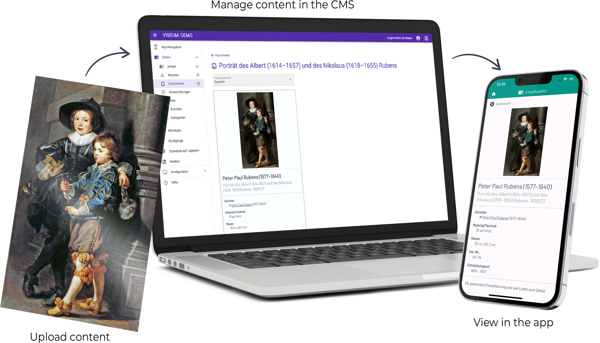

# AR Museum

#### ETH, GTC (2018-2021)
**Technology Stack:** *Unity, C#, Vuforia, OpenCV, Vue.js, Javascript, MongoDB, GridFS, Google BigData*

How can museum visits be enhanced with modern technology - especially AR? That was the main question we were tasked to solve. The result is a platform that allows museum curators to author their own AR content through a web-based content management system (CMS) and museum visitors to experience said content through an app running on their personal device. The user facing app was developed with Unity, C# and Vuforia as AR image tracker. The curator facing website is implemented with Javascript, Vue.js and a MongoDB database.   
Nowadays, this AR museum platform is part of an ETH Spinoff and marketed under the name [Viseum](https://aperionxr.com).

  

*Overview of the AR Museum platform (@Aperion XR, 2024).*  

### My Contributions
I was mainly involved in the creation of the UI and AR functionalities on the Unity app, but also contributed to the frontent (Vue.js) and backend (Javascript) of the CMS website.  

#### AR App
I created several **AR functionalities**, such as displaying videos on top of the art-pieces, or a slider interaction, allowing to see two different versions of the same painting. One additional notable AR functionality I implemented is a *face-swap* feature (OpenCV), allowing museum visitors to place their faces instead of pre-defined faces on some of the paintings in the museum and seeing the result in AR. Challenges were mainly the face-detection, re-coloring of the taken photograph to match the style of the painting and a simple UI to present the feature to the museum visitors. This was accomplished with OpenCV and overlaying the physical painting with an AR-based UI.  
Furthermore, I implemented a **wiki-style UI** for visitors to read the textual information the curators want to empart. The wiki also supports **videos** and **image galleries** to be displayed in the app. I also signed responsible for developing a visual floorplan with all paintings of the exhibition as authored in the CMS. 
All UI developments were done in close collaboration with the in-house digital artist who guided the design process.  

#### Web CMS
On the CMS-side I spent notable time to develop a **visualization framework of the user data** gathered by the AR app. This includes Google BigData queries, visualization of the SVG floorplan and adding additional SVG content to visualize and highlight paths users have taken through the exhibition space. Following this line of work, I was also responsible for creating an SVG-based **editor to place art pieces** on an SVG image of the floorplan of the exhibition. 
Furthermore I created various pages to **display and edit information stored in the database**, integrated the **file-upload system**, as well as the GridFS filesystem for the MongoDB database, and contributed greatly to the overall datastructures used in the database.  

### Videos
  
*Presentation of the app in Zurich for an exhibition of the ETH Graphische Sammlung (@GTC, 2020).*

  
*Presentation of the app in Vienna for an exhibition of the Princely Collections (@GTC, 2021).*

<iframe width="560" height="315" src="https://www.youtube.com/watch?v=3NR8IrEAsyI" frameborder="0" allow="accelerometer; autoplay; clipboard-write; encrypted-media; gyroscope; picture-in-picture" allowfullscreen></iframe>

### Links
- [Research Page (ETH)](https://gtc.inf.ethz.ch/research/augmented-and-virtual-reality-research/behind-the-art.html)
- [Viseum (Aperion XR)](https://aperionxr.com/)