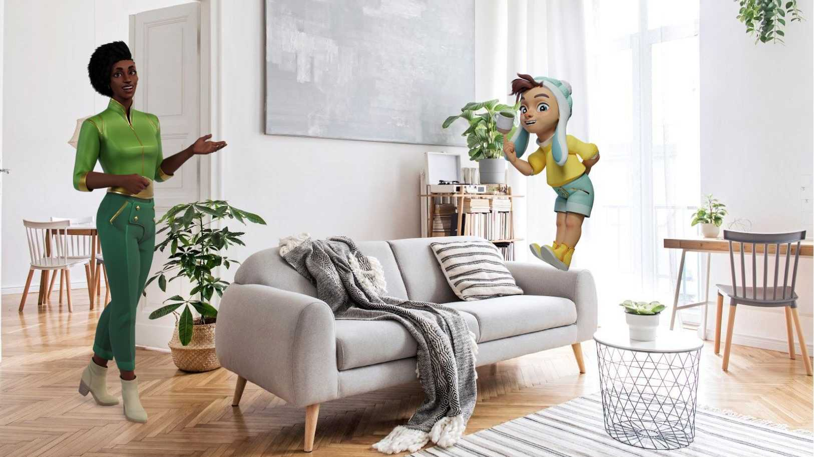
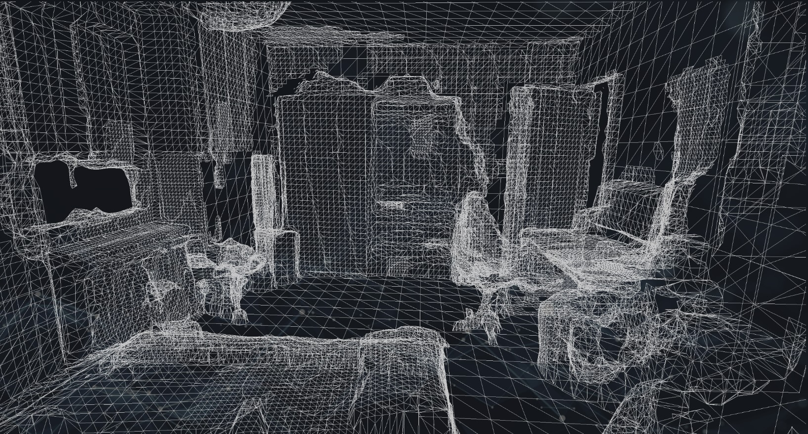
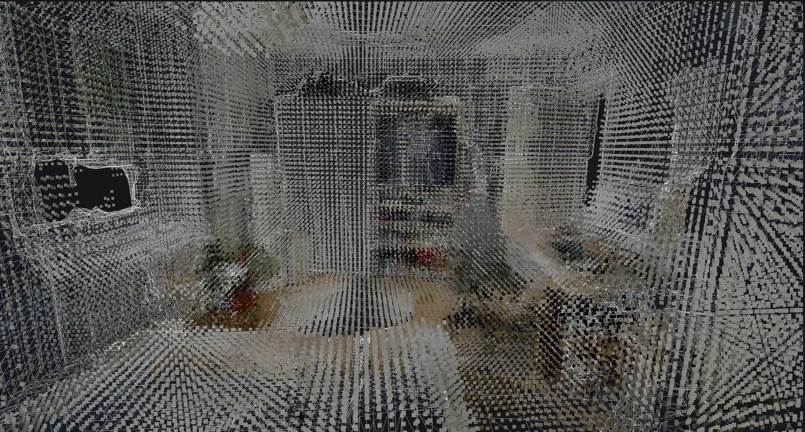
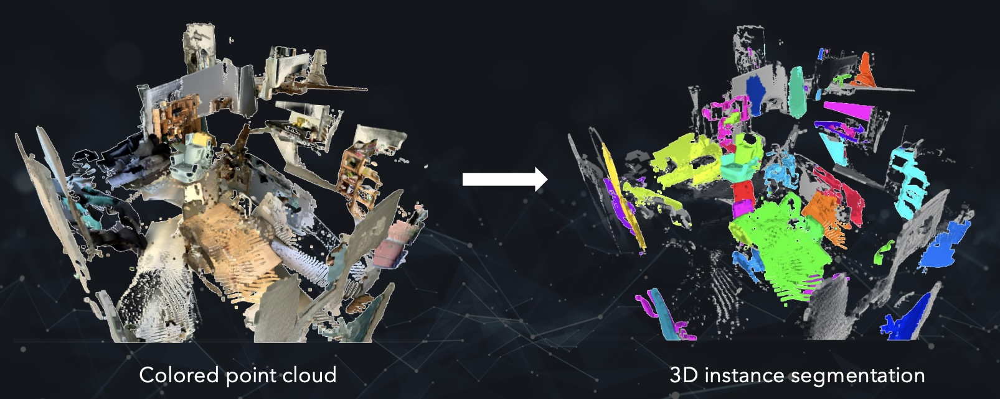
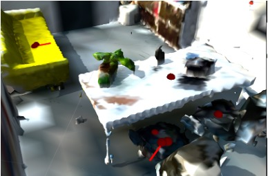

### ETH, Game Technology Center (2021-2024)
**Technology Stack:** *Unity, C#, ARFoundation, Python, Google TTS, GPT-3.5*

  

    
  

  

    
  

  

    
  

  

    
  

  

    
  

  

    
  

  

The aim of this research project was to develop authoring tools for AR (Augmented Reality) experiences that feature intelligent virtual characters. Specifically, the characters should be aware of their surroundings and be able to interact with it and the user. To this end, we developed an authorable <b>storytelling engine</b>, a <b>scene understanding</b> module, <b>3D animation controllers</b> and modules related to various existing <b>AI (artificial intelligence) technologies</b> on top of the Unity game engine.

The project was a collaboration between Disney Research|Studios and the Sejong University in Seoul. I have been the lead architect on the Swiss side and contributed to the code, coordinated the work of my colleagues and students who did their theses on this project. 
</b>

<h2>Prototypes</h2>
We developed 3 major prototypes over the course of this project. 

The first prototype was a <b>virtual museum guide</b>, who could guide the user through a physical art museum and tell stories about the paintings, while pointing out the various details by hand.

  <embed
    src="https://www.youtube.com/embed/tInU3o2MZXc?autohide=1&autoplay=0"
    wmode="transparent"
    type="video/mp4"
    width="100%" height="100%"
    allow="autoplay; encrypted-media; picture-in-picture"
    allowfullscreen
    title="Keyboard Cat"
  >

  <i>Trailer of the first prototype (@GTC, 2023).</i>

The goal of the second prototype was to leverage our custom scene understanding module and animation system to interact with the detected objects. Due to the upcoming of Large Language Models (LLMs) at the time, we also integrated a proper chatbot functionality for the character. The result was a <b>tech-demo</b>, in which a child from a different dimension comes to visit your home and is eager to explore the different treasures of your home - meaning anything that can be detected by the scene understanding module.

  <embed
    src="https://www.youtube.com/embed/oUiEA9RSg_w?autohide=1&autoplay=0"
    wmode="transparent"
    type="video/mp4"
    width="100%" height="100%"
    allow="autoplay; encrypted-media; picture-in-picture"
    allowfullscreen
    title="Keyboard Cat"
  >

  <i>Trailer of the second prototype (@GTC, 2023).</i>

The goal of the third prototype was to build an experience that uses all the developed technologies and that could be used as a commercial app. For this we went with a <b>language practicing app</b>, where the user can choose one of three different teachers, one of 12 languages and their current level of said language. The AR teacher will offer various exercises that are connected to the objects in the room. The exercises are generated by an LLM at runtime and range from listening exercises, to discussing topics, and roleplay.

<h3>Student Prototypes</h3>

  Further small prototypes were created by students as their bachelor's or master's project, such as talking objects, an animal pet simulation, airship battles in the living room, or a choose-your-own-adventure story generator incorporating physical objects as locations of the story.

<h2>Technologies</h2>
<h3>Scene Understanding</h3>

  To enable the characters to get an understanding of their physical environment, we use existing technologies, such as ARFoundation  and custom neural network pipelines based on <a href="https://github.com/facebookresearch/detr">End-to-End Object Detection with Transformers (DE:TR)</a>, <a href="https://github.com/JonasSchult/Mask3D">Mask3D</a> and <a href="https://github.com/Gorilla-Lab-SCUT/AffordanceNet">3D AffordanceNet</a>. The first step is to generate a <b>3D mesh representation of the environment</b> at runtime. For this we use the meshing ability of ARFoundation (which internally uses ARKit). 

  
<video src="../assets/videos/kiat-sceneMesh.mp4" class="float-left;" style="display:inline-block; margin:0; margin-left:3%; aspect-ratio:3/4; width:27%;" controls></video>

    <i>3D mesh generation and representation in our AR app.</i>

  On the generated mesh, we can continuously build a <b>NavMesh</b> for the character to <b>walk and navigate</b> on. Furthermore we can use the mesh to correctly <b>occlude any virtual object</b> when it is behind some physical object. For the museum guide prototype, we further needed an abstract representation of the museum, such that the character could guide the user to the next painting, even if that part of the museum has not yet been scanned by the user. The first approach was with an invisible 3D graph that is anchored on the AR images, the second one by serializing the NavMesh and loading that one again in the next AR session.

  To detect physical object instances, we have two different pipelines: DE:TR with 3D Lifting and Mask3D.

  <b>DE:TR with 3D Lifting:</b> The input for this pipeline are the RGB-D image as acquired by the iPad Pro, the depth confidence image and the camera intrinsics. All of them are sent by REST request to the remote server where the pipeline is running. We run DE:TR on the RGB image to find the 2D object segmentations. Next up, we use the depth-image and camera intrinsics to lift the 2D segmentations into 3D (backprojection). The depth-confidence image is used to filter out 3D points that are too uncertain. With this pipeline we get a partial point-cloud for each detected object, which are then sent back to the AR application. On the side of the AR application, we try to merge the new detections with already detected object instances or instantiate a completely new instance if no correspondance is found. 
  The runtime of this pipeline is roughly 0.6s and, due to the high resolution of the RGB image, works for any size of object.

  <b>Mask3D with 3D Affordance Prediction:</b> One problem of the DE:TR with 3D Lifting approach is that we only get a partial point-cloud of the object. However, in order to predict the 3D locations of affordances, which would allow our character to perform realistic looking animations with that object, we require a full point-cloud representation of that object. Thus, we use Mask3D. As input it requires a colored point-cloud of the environment. As ARFoundation did not support colored or textured environment-meshes at the time this project was made, we implemented our own color prediction based on the RGB-D images. 

  

    <i>Color cloud representation of a room as generated by our AR app.</i>

  We extract the mesh around the AR user at runtime, including the vertex colors, and send it via REST request to our custom Mask3D server. Since the environment mesh generated by ARKit is not particularily dense in flat areas, we sample several points per triangle to get a more dense representation to feed into Mask3D. The segmented object point-clouds are further filtered and then handed to 3D AffordanceNet to predict interaction points for a pre-defined set of affordances. The point-clouds of the detected objects and the best interaction points are sent back to the AR application, where they are again merged with existing object instances or instantiated as a completely new instance. 
  The runtime of this pipeline is roughly 2s and, due to the low resolution of the environment mesh, only works for larger objects, such as chairs.

  
  

    <i>Object segmentation from a colored point-cloud with Mask3D and affordance predictions (in red) including orientation for a SitDown affordance.</i>

<h3>Storytelling Engine</h3>

  Every interactable object in our AR app is modeled as a <b>StoryObject</b>, which can have a set of <b>affordances and capabilities</b>. A chair for example offers the affordances <var>SitDown</var> and <var>GetUp</var>. It does not have any capabilities as it is passive. A virtual character on the other hand might have the affordances <var>TalkTo</var> and <var>PointAt</var>. But since it is an active object it can also have capabilities, such as <var>SitDown</var>, <var>GetUp</var> and <var>TalkTo</var>, whcih allows it to use the affordances of other StoryObjects. 
  Stories in this application are authored as a chain of affordance/capability pairs, meaning each active StoryObject has a sequence of capabilities to execute on other StoryObjects. Each affordance/capability pair is subject to <b>dependencies</b>, which - once fulfilled - will trigger the related interaction. Dependencies are fulfilled by either the start or end of another pair, by a timer or by user interactions or a combination thereof.

  During student theses we did some further experimentations with Monte Carlo Tree Search-based narrative planners and dialog or affordance generation with LLMs which were connected with the existing storytelling engine.

<h3>3D Animation System</h3>

  The main goal of the animation system is to allow interactions with physical objects of which we do not know the exact shape or size at compile time of the application. Thus, we use Inverse Kinematics (IK) to modify artist-crafted animations at runtime in such a way that a specific point in 3D is hit at a specific time of the animation. This is based on <a src="https://studios.disneyresearch.com/2019/10/27/parameterized-animated-activities/" target="_blank" rel="noopener noreferrer">previous work</a> by Disney Research|Studios. Further work has been done to better blend these kinds of animations among each other, as well as with the Unity Mecanim animation system. 
  When interacting with a virtual character, it is often desirable to keep that character in the center of the user's view. For the character to reposition themselves upon small movements of the user's head, default locomotion is neither efficient nor realistic looking. Thus, in a student thesis, we developed a <a src="https://dl.acm.org/doi/10.1145/3623264.3624450" target="_blank" rel="noopener noreferrer">data-based motion adaptation approach</a> that allows the character to perform small steps to the side, back or front. 
  Furthermore, we use an existing lip-sync solution to allow our characters to have semi-realistic lip sync while talking. Facial blendshapes can also be triggered through the storytelling engine or a mood analysis powered by GPT.

<h3>AI Integration</h3>

With the upcoming of LLMs during the course of this project, we also spent a substantial amount of time to create a flexible system that sends the transcribed user-input to intent recognizers like Microsoft's Conversational Language Understanding (CLU) and OpenAI's GPT-3.5 and GPT-4 for analysis or response generation. In order to give our characters a consistent personality, we paid special attention to encode the personality in the completion requests sent to GPT. Additionally, the conversation is summarized when reaching a specific length to ensure the generation does not get too costly while still remembering the most important parts of the conversation so far.  
We also use GPT to analyze the character's mood, based on what they hair/say and what they can see. The mood can then drive facial blendshapes or be integrated into the prompt for future responses. 
Intent recognition (either through CLU or GPT) is used to trigger specific aspects of the story. In the latest prototype we also use GPT to generate dialogs between virtual characters and responses to the user in different languages, even though the prompt language is English. For some languages this works very well, whereas others are definitely not as stable as say English, French and German. 

We use Google Text to Speech, to give our characters a voice. The author only has to define a voice for the character in the Unity editor and the text to speek, or simply let the GPT chatbot behavior do the dialog scripting.
