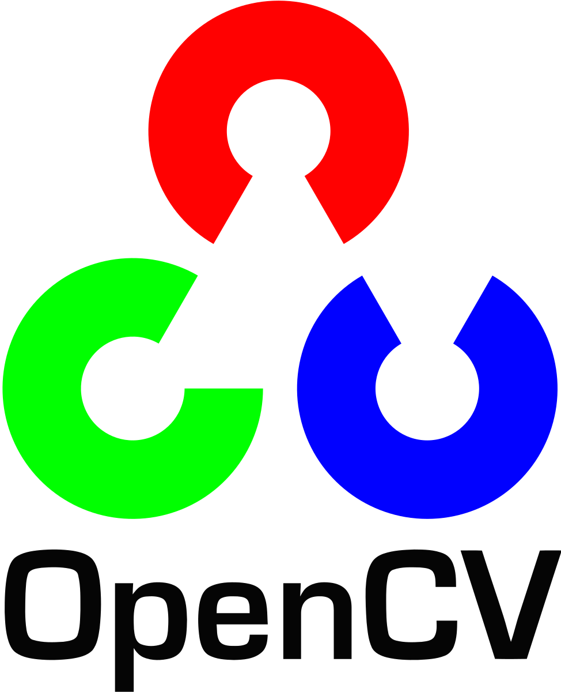
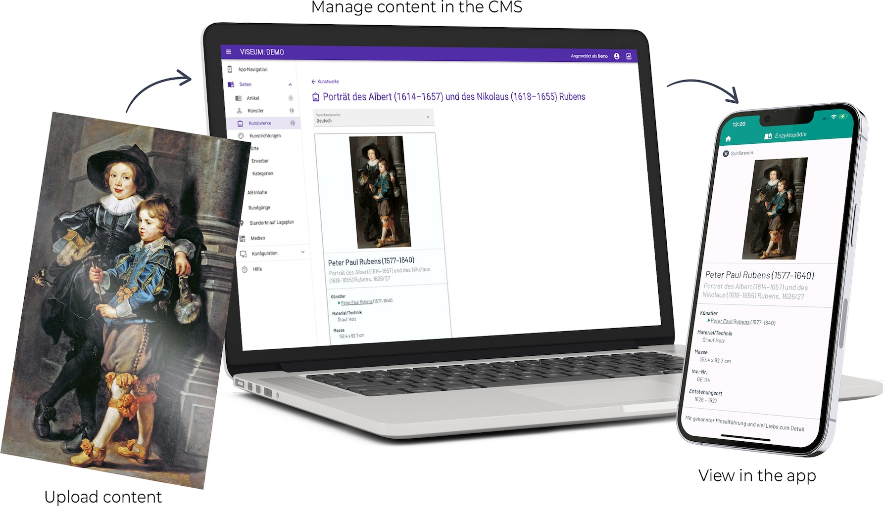
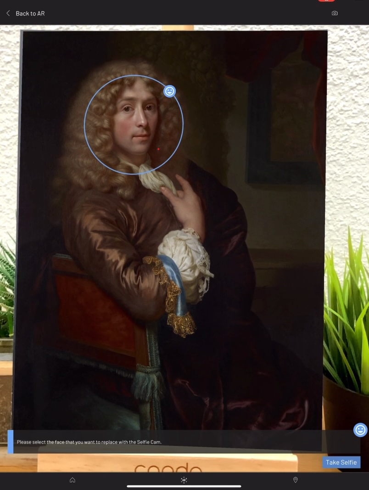
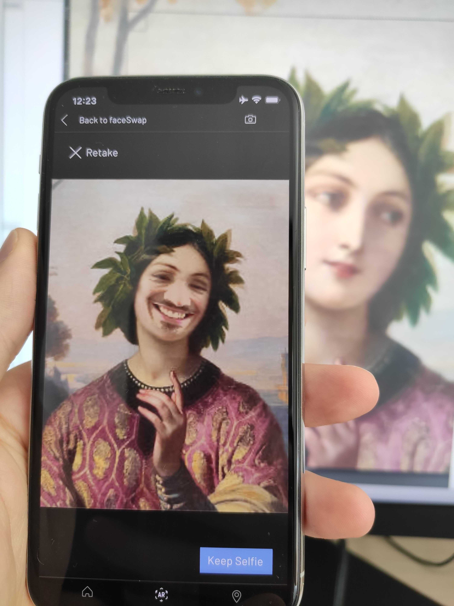
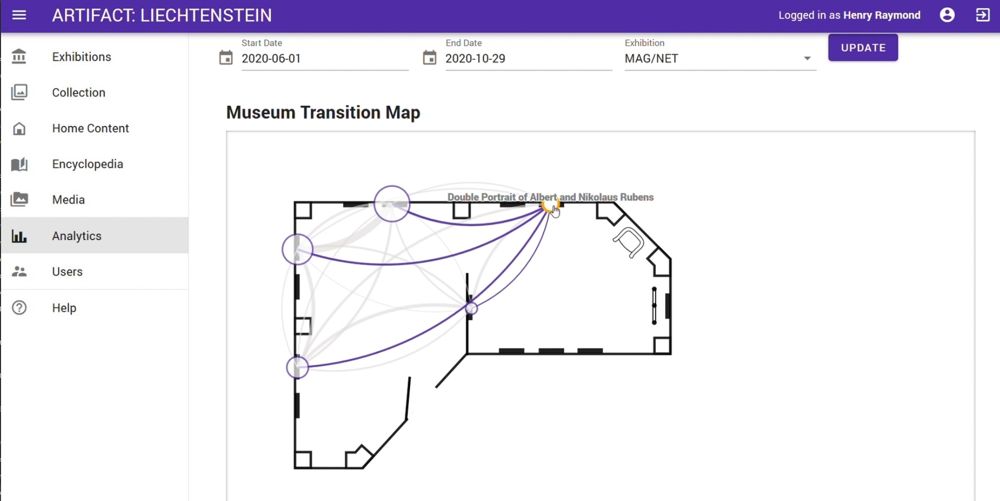
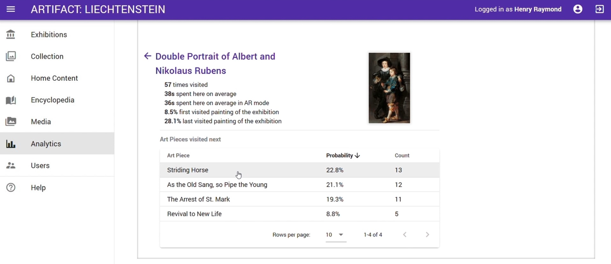

<h2>ETH, Game Technology Center (2019-2021)</h2>

**Technology Stack:** *Unity, C#, Vuforia, OpenCV, Vue.js, Javascript, MongoDB, GridFS, Google BigQuery*

  

    
  

  

    
  

  

    
  

  

    
  

  

    
  

  

    
  

  

    
  

  

    
  

<h3 class="intro-text">
    How can museum visits be enhanced with AR? That was the main question we were tasked to solve. The result is a platform that allows museum curators to author their own AR content through a web-based Content Management System. The authored content is then presented to the museum visitors through an AR app running on their personal devices. This AR museum platform is now part of an <b>ETH Spinoff</b> and marketed under the name <a href="https://aperionxr.com">Viseum</a>.
</h3>

  <embed
    src="https://www.youtube.com/embed/sa1C9v-zqLg?autohide=1&autoplay=0"
    wmode="transparent"
    type="video/mp4"
    width="100%" height="100%"
    allow="autoplay; encrypted-media; picture-in-picture"
    allowfullscreen
    title="Keyboard Cat"
  >

  <i>Trailer of the exhibtion in Vienna of the Princely Collections (@GTC, 2021).</i>

The museum visitor facing app was developed with Unity, C# and Vuforia as AR image tracker. The curator facing web-based Content Management System (CMS) is implemented with Javascript, Vue.js and a MongoDB database.   

  

    <i>Overview of the AR Museum platform (@Aperion XR, 2024).</i>

## My Contributions
I was mainly involved in the creation of the UI and AR functionalities on the Unity app, but also contributed to the frontent (Vue.js) and backend (Javascript, MongoDB) of the CMS website.  

### AR App
I created several **AR functionalities**, such as displaying videos on top of the art-pieces, or a slider interaction, allowing to see two different versions of the same painting. One other notable AR functionality I implemented is a **face-swap** feature (OpenCV), allowing museum visitors to put their face onto paintings, replacing the original face the artist painted there. Challenges were mainly the face-detection, re-coloring of the taken photograph to match the style of the painting and a simple UI to present the feature to the museum visitors. This was accomplished with OpenCV and overlaying the physical painting with an AR-based UI.  

    <i>Face-swap UI (left) and example of a swapped out face (right) (@ETH, 2021).</i>

Apart from the AR functionality, I implemented a **wiki-style UI** for visitors to read the textual information the curators want to empart. Apart from test, the wiki also supports **videos** and **image galleries** to be displayed in the app. I also signed responsible for developing a **visual floorplan** with all paintings of the exhibition as authored by the curator in the CMS. Last but not least, I developed a **tour mode**, which guides the visitors along a tour covering a specific theme of the exhibition. These tours are also authored by the curator in the CMS.
All UI developments were done in close collaboration with the in-house digital artist who guided the design process.  

  <embed
    src="https://www.youtube.com/embed/3NR8IrEAsyI?autohide=1&autoplay=0"
    wmode="transparent"
    type="video/mp4"
    width="100%" height="100%"
    allow="autoplay; encrypted-media; picture-in-picture"
    allowfullscreen
    title="Keyboard Cat"
  >

  <i>Trailer of the "Parallelen" exhibition at the ETH Graphische Sammlung in Zurich. The video showcases, among others, the AR slider interaction and the Wiki (@ETH, 2020).</i>

### Web CMS
On the CMS-side I spent notable time to develop a **visualization framework of the user data** gathered by the AR app. This includes Google BigQuery requests, visualization of the SVG floorplan and adding additional SVG content to visualize and highlight paths users have taken through the exhibition space. Following this line of work, I was also responsible for creating an SVG-based **editor to place art pieces** on an SVG image of the floorplan of the exhibition. 
Furthermore, I created various pages to **display and edit information stored in the database**, integrated the **file-upload system** and helped building the overall datastructures used in the database together with my colleagues.  

    <i>User data analysis on the CMS (@ETH, 2021).</i>

### Student Thesis Supervision
For this project, I supervised two Bachelor theses. Both included existing neural networks to animate paintings: One creates an [animated version of landscape paintings](https://gtc.inf.ethz.ch/research/student-projects/animated-paintings.html), by making clouds move and potentially change the time of day. The other one uses a short video of the user's face, extracts the facial expressions and [animates a selected portrait painting](https://gtc.inf.ethz.ch/research/student-projects/facial-expression-transfer-ar.html) with it. 

## Links
- [Research Page (ETH)](https://gtc.inf.ethz.ch/research/augmented-and-virtual-reality-research/behind-the-art.html)
- [Viseum (Aperion XR)](https://aperionxr.com/)