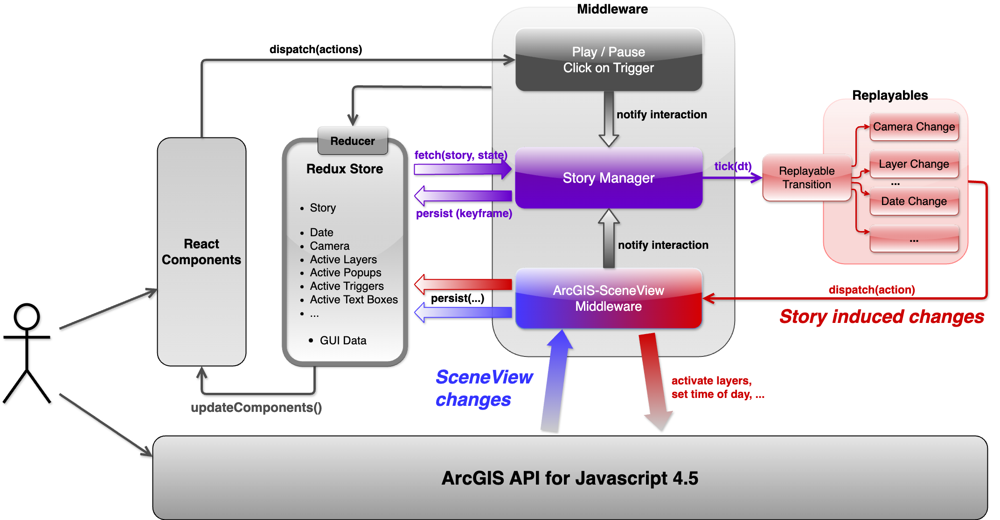

### Esri R&D, Zurich (2017)
**Technology Stack:** *Javascript, Ract, Redux*

  

    
  

  

    
  

  

    
  

<video src="../assets/videos/esri.mp4" controls></video> 

    <i style="font-size:0.8em;">Example presentation of the relocation of a USPS office in the Redlands.</i>

Bring interactive PowerPoint presentations to Esri's ArcGIS framework. That was essentially the task for my 6-month internship. Under the lead of my supervisor, I created a React/Redux based application to create and visualize dynamic presentations with the ArcGIS API. 
The UI for the presentation mode is handled by React, which reflects any changes done in the Redux store. Similarly, certain changes in the Redux store invoke function calls on the ArcGIS API to perform visual changes, such as camera movements, time-of-day changes, addition/removal of 3D objects, etc.

To generate such dynamic presentations, the user can set a keyframe for the current camera location of ArcGIS. Additionally, for each keyframe, the user can select the time-of-day, which ArcGIS layers should be active and if there should be custom HTML elements visible at certain locations. A chain of such keyframes is then interpolated between during presentation mode to get smooth camera movement as well as smooth blending between the 3D and HTML elements that should be active. Furthermore, keyframes can have more than one follow-up frame, allowing for interactive branching in the visual "story". In such cases the user can select which branch of the story they want to explore next. If not, the author can decide for a default follow-up branch to be triggered automatically after a timeout.
Presentations are saved in JSON format.

  

    <i style="font-size:0.8em;">Overview of the implemented application.</i>

<video src="../assets/videos/esri-ui.mp4" controls></video> 

    <i style="font-size:0.8em;">Demonstration of the HTML elements.</i>

### Links
- [ArcGIS](https://www.arcgis.com/)