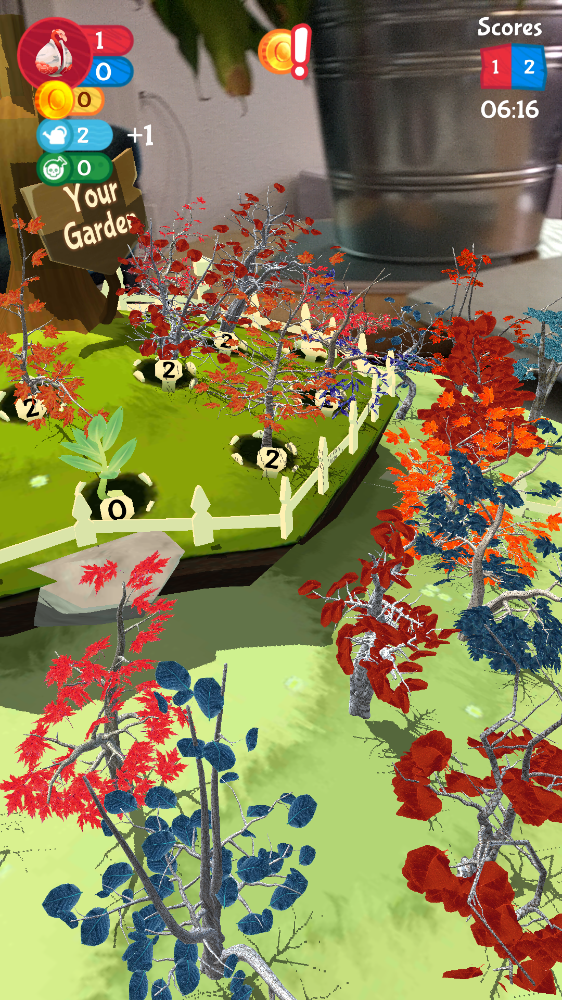

### ETH, Game Technology Center (2019-2020)
**Technology Stack:** *Unity3D, C#, Firebase, Vuforia*

Gnome Trader Millennium is a team-based multiplayer AR game that is intended to be played outside. It is an adaptation of previous work at the Game Technology Center. Two teams face off against each other to win as many seeds as possible. Seeds can either be bought at gnome shops or harvested from trees. But, to grow a tree, you first have to plant a seed and water it. Seeds can be planted in your team's garden. Both, the 4 shops and gardens are only accessible at physical locations, where their respective AR image markers are placed. 

<i style="font-size:0.8em;">Gnome shops and garden.</i>

Data synchronization between the players works through Firestore (Firebase). As the game was developed as a use-case for the FLAME (Horizon 2020) project, we also download the tree assets from a remote database and display them in-game. The idea is to have thousands of unique tree shapes and designs to keep the visual experience novel at all times. The prices for the seeds in the gnome shops follows a supply and demand principle. Thus, buying seeds cheaply in one shop and selling them at another one where they are rare can give you in-game money in no time - albeit with some physical exercising to run to the other gnome shop. The money can then be used to buy new seeds or a bottle of poison, which allows to harm the trees in the opponent's garden - slowing down the speed at which they can harvest their trees. 

After a flexible timelimit the game is automatically terminated and the team with the most seeds in their inventory is declared the winner.

Some technical challenges worth mentioning are: 1) re-connection into the same game and as the same player in case that one device crashed, 2) downloading asset bundles at runtime for the tree models, 3) concurrent synchronization of the game state through Firestore and 4) easy-to-understand UIs for the various interaction modalities in the game.

<h3>Links</h3>  

- <a href="https://gtc.inf.ethz.ch/research/game-technology-research/city-wide-ar-gaming.html">Gnome Trader Millennium project page (ETH)</a>

 

