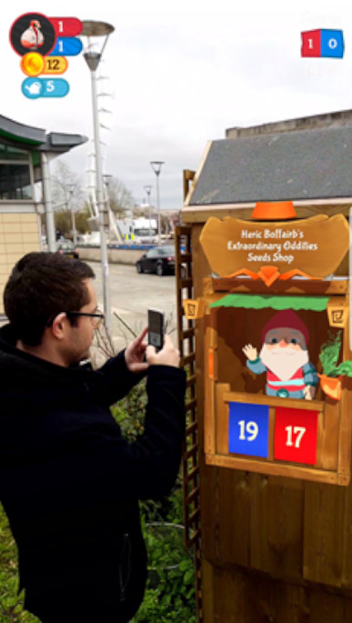
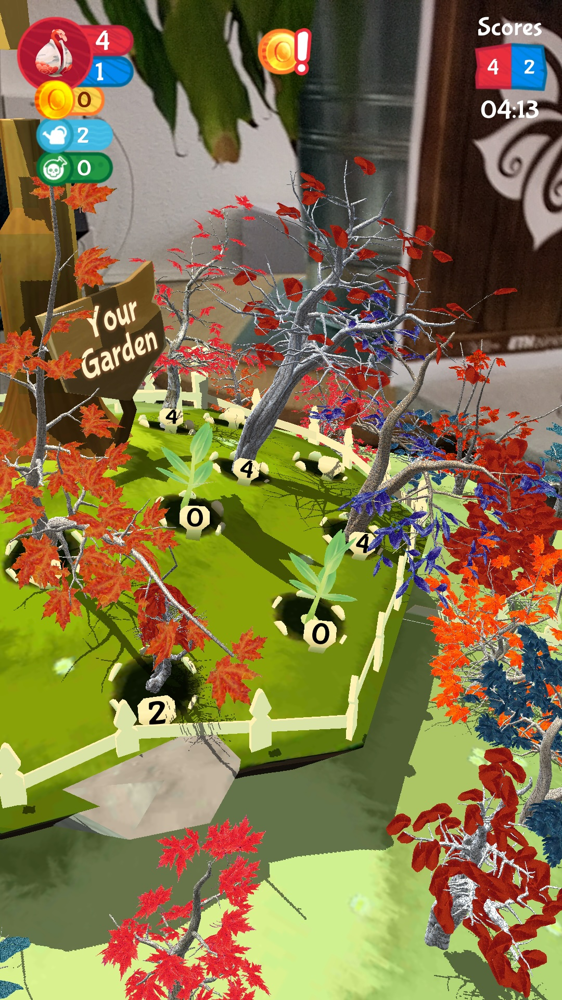
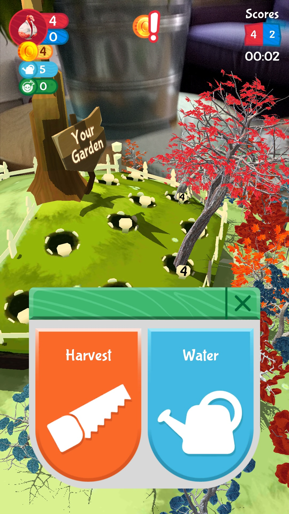
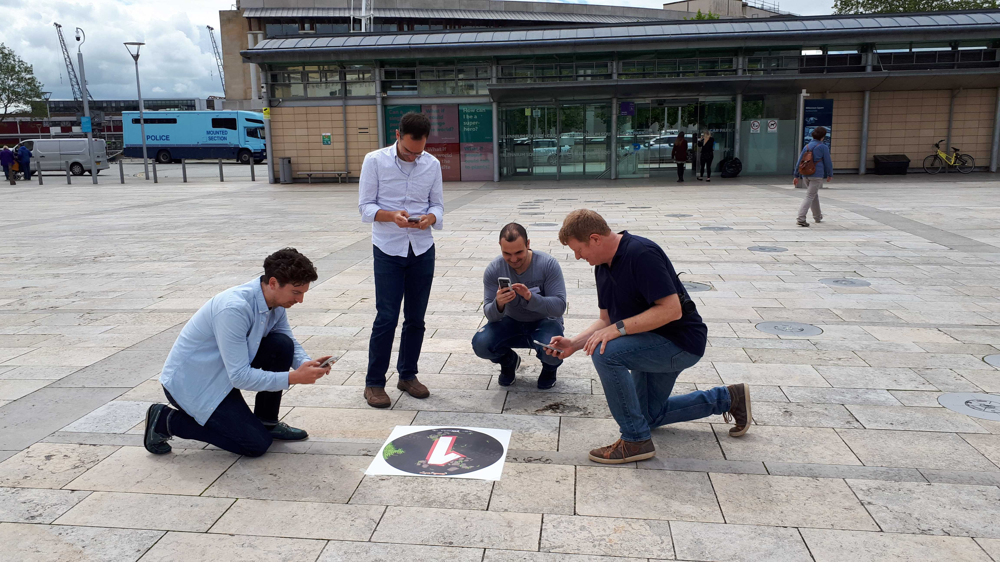
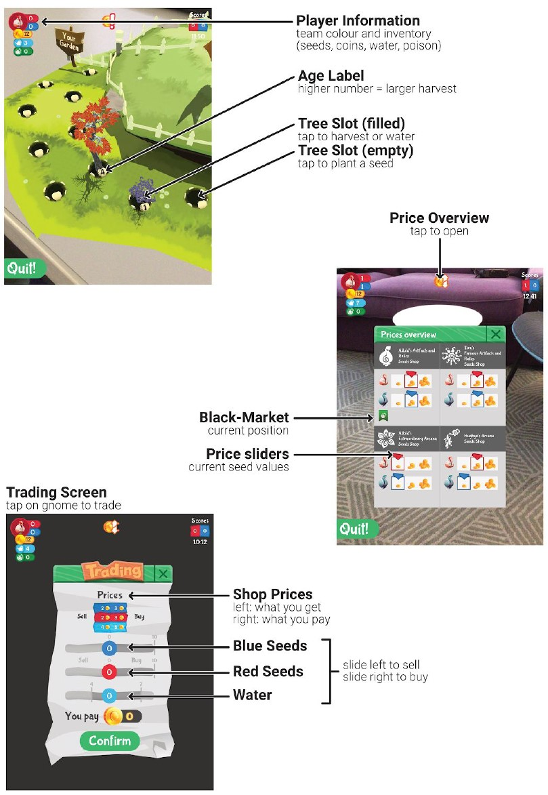

<h2>ETH, Game Technology Center (2019-2020)</h2>

    <b>Technology Stack:</b> <i>Unity3D, C#, Firebase, Vuforia</i>

<!-- 

  

    
  

  

    
  

  

    
  

  

    
  

  <!-- Need to clear float, such that parent elements gets height of contained content. -->
  <!-- 

 -->

<h3 class="intro-text">
    <i>Gnome Trader Millennium</i> is a team-based multiplayer AR game that is intended to be played outside. It is an adaptation of previous work at the Game Technology Center that targeted on-the-go AR gaming within a city. In this adaptation, two teams face off against each other to get as many seeds as possible. This game was developed as a use-case prototype for the FLAME (Horizon 2020) EU project.
</h3>

<h2>The Game</h2>
The goal of the competing teams is to get as many seeds as possible. There are two ways to get seeds: buying them at gnome shops or harvesting them from trees. To grow a tree, players however first have to plant a seed and wait - or water it to fasten the growing process. Seeds can be planted in the garden of the player's team. Both, the 4 shops and gardens are only accessible at physical locations - exactly there, where their respective AR image markers are placed. 

    
    
    
    

    

        <i>Gnome shop (left), garden (middle) and harvesting UI (right).</i>
    

    The prices for the seeds in the gnome shops follows a supply and demand algorithm. Thus, buying seeds cheaply in one shop and selling them at another one where they are rare can give you in-game money quite quickly - albeit with some physical exercising to run to the other gnome shop before someone else can. The money can then be used to buy new seeds, water or a bottle of poison, which allows to harm the trees in the opponent's garden - slowing down the speed at which they can harvest their trees.  

    After a flexible timelimit the game is automatically terminated and the team with the most seeds in their inventory is declared the winner.  

    
    

        <i>Outdoor playtesting with people looking at a garden. (@ETH, 2019)</i>
    

<h2>Technical Challenges</h2>

    Some technical challenges worth mentioning are: <b>1)</b> re-connection into the same game and as the same player in case that a device crashes, <b>2)</b> downloading a tree model as asset bundle from a remote database and instantiating it at runtime when a tree is planted, <b>3)</b> concurrent synchronization of the game state through Firestore (Firebase) and <b>4)</b> easy-to-understand UIs for the various interaction modalities in the game.

    <i>The various UI screens during gameplay. (@ETH, 2019)</i>

<h3>Links</h3>  

- <a href="https://gtc.inf.ethz.ch/research/game-technology-research/city-wide-ar-gaming.html">Gnome Trader Millennium project page (ETH)</a>

 

