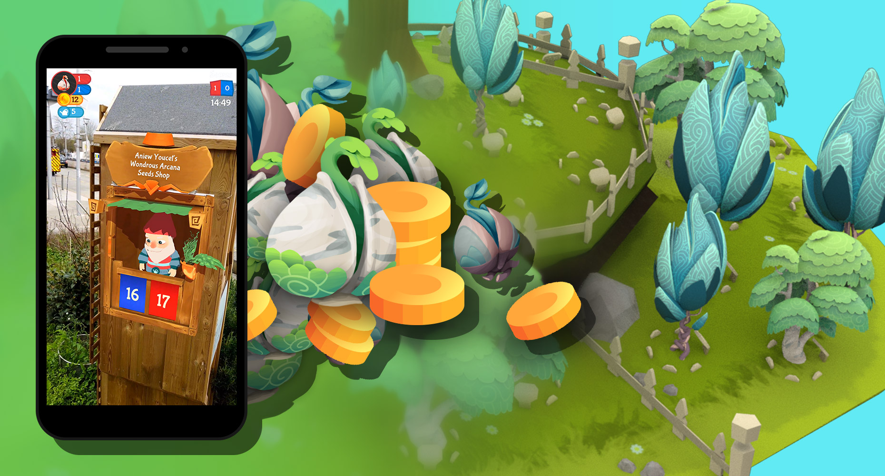

### ETH, Game Technology Center (2019-2020)
**Technology Stack:** *Unity3D, C#, Firebase, Vuforia*

  

    
  

  

    
  

  

    
  

  

    
  

*Gnome Trader Millennium* is a team-based multiplayer AR game that is intended to be played outside. It is an adaptation of previous work at the Game Technology Center that targeted on the go AR gaming within a city. In this adaptation, two teams face off against each other to get as many seeds as possible. There are two ways to get seeds: buying them at gnome shops or harvesting them from trees. To grow a tree, players however have to plant one seed and wait - or water it to fasten the growing process. Seeds can be planted in the garden of the player's team. Both, the 4 shops and gardens are only accessible at physical locations - exactly there, where their respective AR image markers are placed. 

    <i style="font-size:0.8em;">Gnome shops and garden.</i>

    The prices for the seeds in the gnome shops follows a supply and demand algorithm. Thus, buying seeds cheaply in one shop and selling them at another one where they are rare can give you in-game money quite quickly - albeit with some physical exercising to run to the other gnome shop before someone else can. The money can then be used to buy new seeds, water or a bottle of poison, which allows to harm the trees in the opponent's garden - slowing down the speed at which they can harvest their trees.  

    Data synchronization between the players works through <b>Firestore (Firebase)</b>. As the game was developed as a use-case for the FLAME (Horizon 2020) project, we also <b>download the tree assets from a remote database</b> and display them in-game. The idea is to have thousands of unique tree shapes and designs to keep the visual experience novel at all times. 

    After a flexible timelimit the game is automatically terminated and the team with the most seeds in their inventory is declared the winner.  

    <i style="font-size:0.8em;">Outdoor playtesting, with people looking at a garden.</i>

    Some technical challenges worth mentioning are: 1) re-connection into the same game and as the same player in case that a device crashes, 2) downloading asset bundles and instantiating the contained 3D model at runtime, 3) concurrent synchronization of the game state through Firestore and 4) easy-to-understand UIs for the various interaction modalities in the game.

    <i style="font-size:0.8em;">The various UI screens during gameplay.</i>

<h3>Links</h3>  

- <a href="https://gtc.inf.ethz.ch/research/game-technology-research/city-wide-ar-gaming.html">Gnome Trader Millennium project page (ETH)</a>

 

