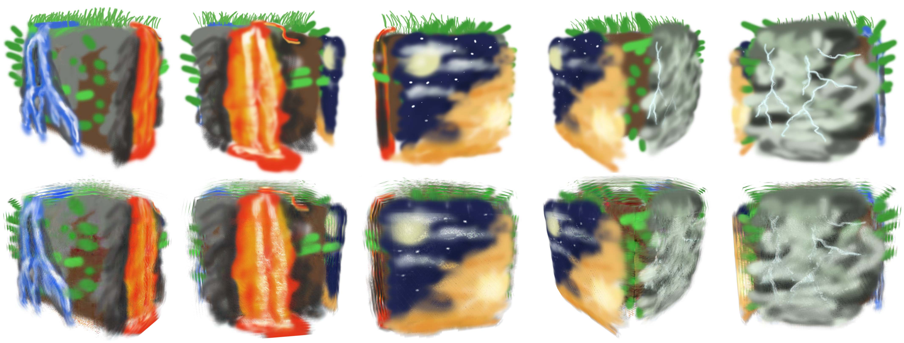
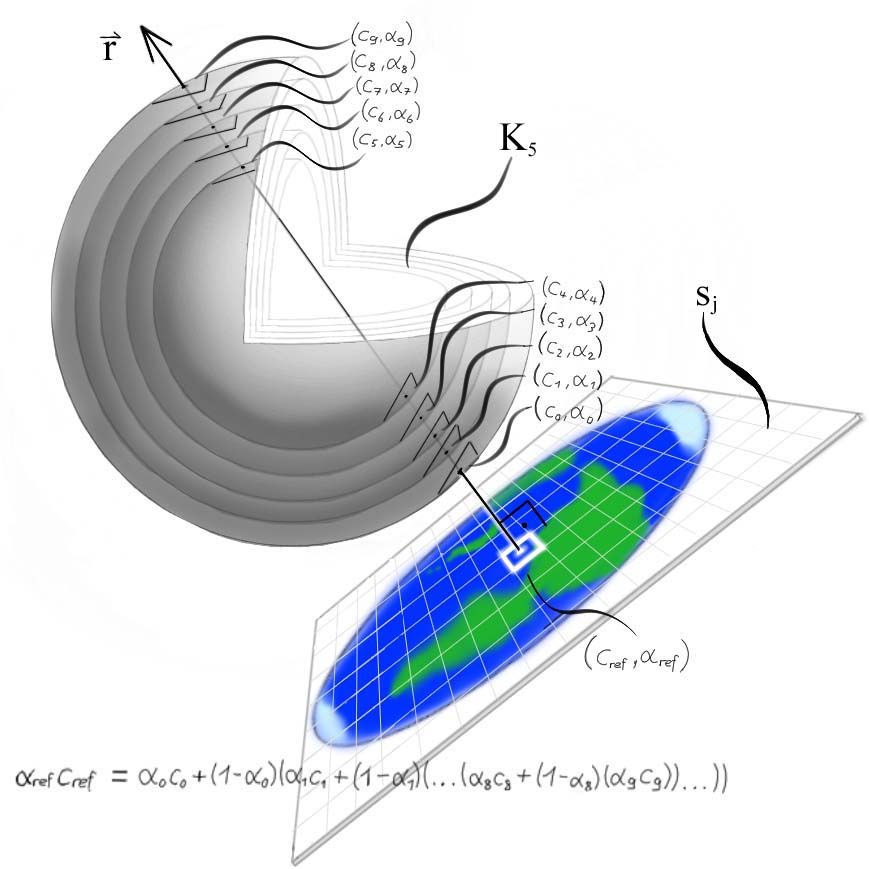
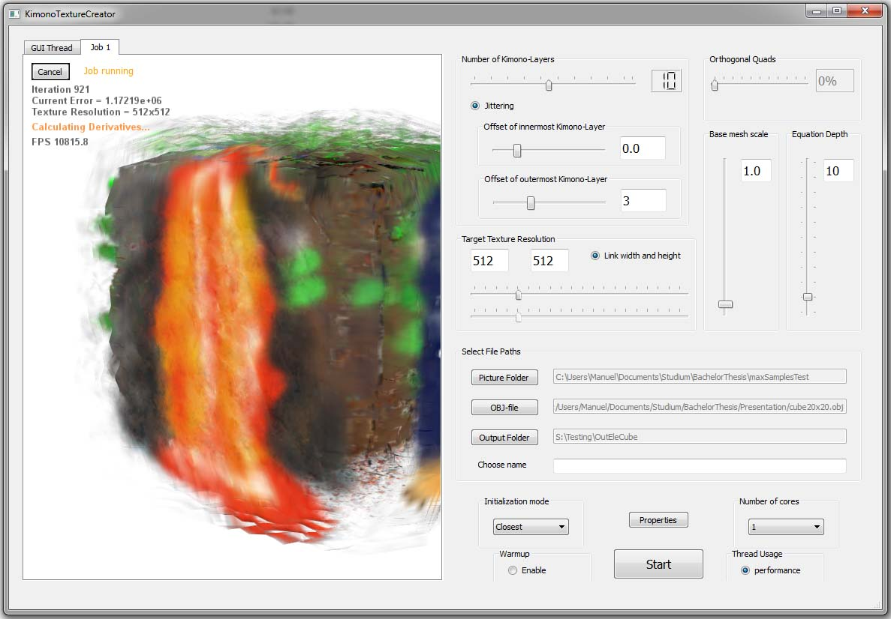

### ETH, Disney Research Zurich
**Technology Stack:** *C++, Qt*

  

My Bachelor thesis was about creating approximations of 3D paintings created by an in-house tool called [OverCoat](https://zurich.disneyresearch.com/OverCoat/). The reason behind this thesis topic was to be able to render such 3D paintings in real-time and to be able to rig and animate them for video games. To this end, I developed a tool with Qt and C++, that can take the 3D shape that was used as the base of the 3D painting and create a layered mesh (like an onion) of it, where each layer is the same mesh, but scaled at a certain factor along the vertex normals. The goal is to calculate the texture for each such layer in such a way that the resulting textured layer mesh looks as close as possible as the 3D painting from any direction. 
This is achieved by sampling the 3D painting from several directions. 

  

Every color of such a sample becomes a condition that needs to be matched by the pixels of the layer mesh's textures involved in rendering the color at that location. This is done by turning each sampled color into an alpha-blending equation including all the pixels of all the layers involved in rendering that color. The unknowns of the equation are the pixel values of the resulting textures. To solve this **overdetermined system of equations**, we employed a L-BFGS solver. Due to the large number of unknowns (in the range of millions), this process can take a while. 

  

This approach managed to render such paintings in real-time albeit with a slight degradation in visual fidelity depending on the size of brush used to draw the 3D painting.
