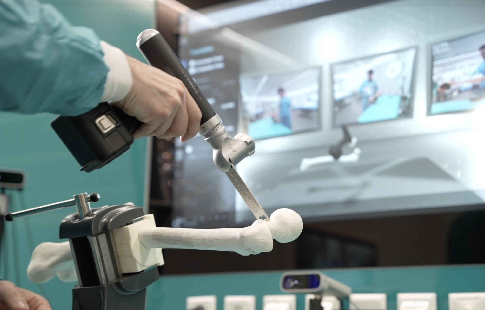

<h2>University Clinic Balgrist, ROCS (2025-2026)</h2>

  <b>Technology Stack:</b> <i>ROS2, Python, Pytorch</i>

<!-- 

  

    
  

  

    
  

  

    
  

  

    
  

  <!-- Need to clear float, such that parent elements gets height of contained content. -->
  <!-- 

 -->

<h3 class="intro-text">  
Digital tool tracking enables surgeons to rely on computer based methods to localize tools in relation to relevant anatomical structures during high-precision surgeries. These tracking methods rely on optical markers  attached to the tools, causing substantial overhead for setup, high costs for special tracking cameras, and occasional loss-of tracking when markers are occluded in the busy OR. Thus methods that purely rely on rgb camera input for tool tracking would be greatly beneficial to simplify tracking. Furthermore, a multiview setup would not only be cheaper, but improve the problems caused by occlusion. In this project, I took openly published code for multiview rgb-based object tracking and turned it into a real-time pose tracking pipeline. While, the original algorithm takes 1+ second for a pose prediction, my optimized version does this in 90ms.
</h3>

  At the core of this pose prediction pipeline is a SurfEmb (surface embedding) model, trained for the objects we want to track. SurfEmb models take an input rgb image and turn it into an image, where each pixel describes the estimated object surface at this pixel as a k-dimensional vector. Additionally, it creates a mask estimating for each pixel how likely it is that the object is there. Furthermore, a MLP encoder allows to assign a k-dimensional vector to any surface sample of the 3D model of the object. Thus, 3D model and query image can be compared to find the 2D-3D relationships between pixels and surface points. 

  <i>(@Balgrist, 2026)</i>

<h2>Object Detection</h2>
YOLO... FR-DETR

<h2>Data Generation</h2>
In order to train the SurfEmb and YOLO models, we require a large amount of rgb data of the tool, and associated ground truth pose, and bounding boxes. While capturing real data is possible (with mentioned marker-based tracking system), it is inherently difficult to setup and calibrate with RGB cameras. Furthermore, to capture diverse enough data, it would need to be setup in various locations. Thus, generating real data with vastly different backgrounds and lighting conditions is only feasible with a lot of manhours. The easier solution is to generate synthetic data - it not only allows to generate images of the tool in various poses and backgrounds, it also delivers the pixel perfect pose and object mask without any camera calibrations. The only downside is that synthetically rendered images are not properly representing real data captured in the target use case, and a real enough rendering of the object's surface is necessary as well. For objects with simple surfaces, this is feasible, but for objects with semi-transparent surface parts, this becomes equally hard.

<h2>ROS2 Interface</h2>
Receiving, bundling, decoding, rectification

<h2>Optimizations</h2>
Subsampling, cuda, compile

<h2>Links</h2>
- <a href="https://github.com/rasmushaugaard/episurfemb">EpiSurfEmb</a>
- <a href="https://www.sciencedirect.com/science/article/pii/S0010482524016214">Scientific Paper: A novel augmented reality-based simulator for enhancing orthopedic surgical training</a>
