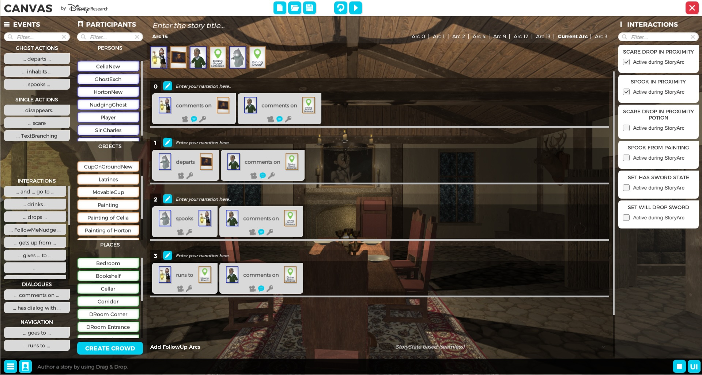

<h2>Disney Research, Zurich (2017)</h2>

    <b>Technology Stack:</b> <i>Unity3D, C#</i>

<!-- 

  

    
  

  

    
  

  <!-- Need to clear float, such that parent elements gets height of contained content. -->
  <!-- 

 -->

<h3 class="intro-text">
    For my master's thesis, I extended an existing story pre-viz framework called <a href="https://studios.disneyresearch.com/2017/07/30/computational-narrative/">CANVAS</a> with the ability to generate interactive stories. Furthermore, I implemented a way to measure user engagement to make recommendations regarding which future branch in the story should be taken to maximize user enjoyment, and nudging the user to take the required actions to get there.
</h3>

<video src="../assets/videos/InteractiveNarratives.mp4" controls></video> 

    <i>Example of interactive stories running in VR and AR.</i>

    The main tasks of my master thesis were to <b>1)</b> integrate modes of user interaction within the existing story framework, <b>2)</b> extending the story framework to support branching, <b>3)</b> accommodate user-interactions at any time through online planning with Monte Carlo Tree Search (MCTS), <b>4)</b> observing the user's interests and matching them to the possible future branches in the story, <b>5)</b> nudging the user into taking certain actions to get on the best future story path.  
    Details can be read in the <a href="https://studios.disneyresearch.com/2018/12/10/a-two-level-planning-framework-for-mixed-reality-interactive-narratives-with-user-engagement/">publication</a>.

      
    

        <i>The authoring UI to create branching stories.</i>
    

## Links:
- <a href="https://studios.disneyresearch.com/2018/12/10/a-two-level-planning-framework-for-mixed-reality-interactive-narratives-with-user-engagement/">A Two-Level Planning Framework for Mixed Reality Interactive Narratives with User Engagement</a>.
