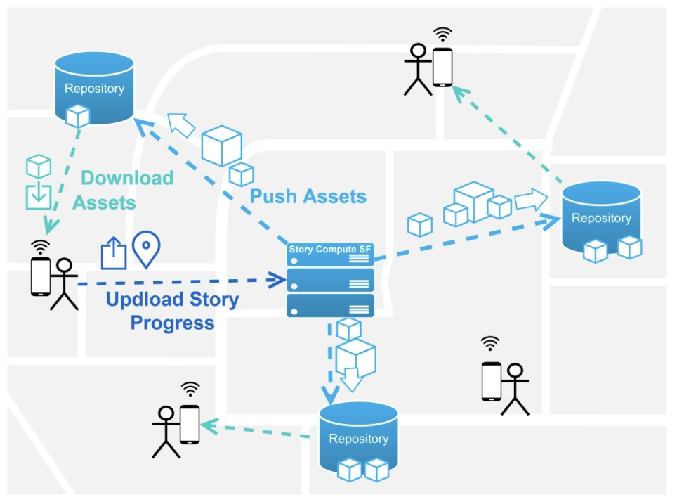

<h2>Disney Research Zurich (2018)</h2>

    <b>Technology Stack:</b> <i>Unity3D, C#, Vuforia</i>

<!-- 

  

    
  

  

    
  

  

    
  

  <!-- Need to clear float, such that parent elements gets height of contained content. -->
  <!-- 

 -->

<h3 class="intro-text">
    As a follow-up to my <a href="master-thesis">Master thesis</a>, we extended the interactive storytelling framework iCANVAS to be able to tell interactive stories through AR within a real city environment. This project was a use-case scenario for the FLAME EU project (Horizon 2020).
</h3>
<h2>Scenario</h2>

    The user enters the city, connects to the network, opens the app and can choose from a variety of stories that can be experienced in this region. Such stories could be used as a means of <b>city tour guide, educational purposes or entertainment</b>. By augmenting the world with 3D objects, even historic scenes could be brought back to life in front of the user's eyes. Life-size virtual 3D stages including virtual actors are anchored at pre-defined lcoations in the city and visualized in AR. The <b>developed prototype</b> is intended for the Millennium Square in Bristol, UK. Due to its rich history in naval discovery and pirates, the story is set in the late 18th century and revolves around oversea trading and pirates.

<h2>Challenges</h2>
<h3>Story</h3>

    One major challenge was the <b>architecture and authoring of longer stories</b>. Especially finding a suitable state representation to accommodate the various user interactions without exponentially authoring more content was difficult and required some artistic freedom. 

<h3>Augmented Reality within a City</h3>

    Due to the limited AR capabilities of mobile devices at the time, the correct placement and orientation of AR stages was rather tricky. Anchoring was done through a <b>combination of AR image target</b> (for the orientation and location) <b>and AR plane tracking</b> to properly place the stage on the physical floor.

<h3>Asset Delivery</h3>

    This project was a use-case scenario prototype for the FLAME project (Horizon 2020). Thus, one major requirement was that the content of the AR stages are downloaded as <b>asset bundles</b> from nearby servers and <b>instantiated by the mobile app at runtime</b>. This also required server-side logic to determine which stage assets need to be uploaded to which server in the city, to be as close as possible to the location where it would be consumed by some mobile device. For this, each connected device sends its progress in the story to a server, which can then decide which assets will be required on which database server in order to serve users in a timely and memory efficient manner.

    
    

        <i>Schema of the network for the prototype, including the Story Compute Server and Repository nodes to download assets from.</i>
    

