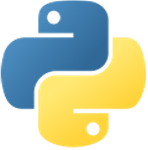
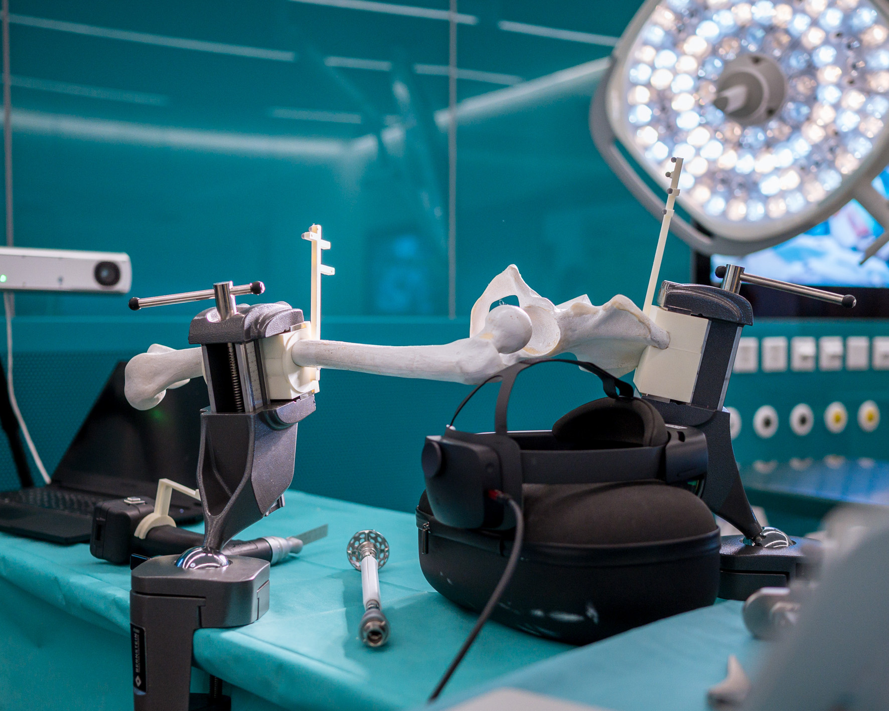

<h2>University Clinic Balgrist, ROCS (2025-2026)</h2>

  <b>Technology Stack:</b> <i>Unity, C#, ROS2, Python, Hololens 2</i>

<!-- 

  

    
  

  

    
  

  

    
  

  

    
  

  <!-- Need to clear float, such that parent elements gets height of contained content. -->
  <!-- 

 -->

<h3 class="intro-text">  
The <a href="vhttps://www.surgicalproficiency.ch/project">PROFICIENCY</a> project, funded by Innosuisse, established a consortium of research institutes and hospitals from all around Switzerland to work on the future of orthopedic education. In the scope of this project, I was working on an XR simulator that allows resident surgeons to practice with the real tools at any time, in a low-risk, low-cost environment. To this end, we used the Microsoft Hololens 2 to spatially display relevant information for each stage of the surgery, while tracking the surgical tools and sawbones in real-time to guide the user and give instantaneous feedback. 
</h3>

  The developed simulator consists of two main logical parts: 1) the Hololens 2 app, developed in **Unity**, to visualize real-time information and offering the main user interface to the user, 2) a server, running several **ROS2 nodes** that offer real-time tracking data, and perform compute-intensive tasks for the Hololens. 

  <i>(@Balgrist, 2025)</i>

  This simulator was a collaboration between the <a href="https://rocs.balgrist.ch/de/">ROCS Team at the University Clinic Balgrist</a>, and the <a href="https://www.zhaw.ch/en/engineering/institutes-centres/ids">Institut for Data Science at the Zurich University of Applied Sciences (ZHAW)</a>. At the time I took over this work in April 2025, there was already a working prototype. Over the coming 1.5 years, I integrated cutting-edge research results from PhDs into the project, and polished the experience into a workable prototype.

<h2>UI</h2>
I reworked the existing UI to improve the visual experience and responsiveness to inputs.

<h2>Tool & Device Tracking</h2>
During this project we experimented with two different tracking methodologies:

<h3>Marker-based</h3>
With 300Hz and submillimeter precision, the Atracsys Fusiontrack 500 is one of the few tracking devices that have made it into the operating room to support surgeons during surgeries, where precision is paramount. It uses infrared light to track highly reflective fiducials inside the working environment. Poses are calculated based on the pre-defined marker geometry (a unique arrangement of 4 or more fiducials) for each object to track. Therefore, we attach unique marker arrays to each tool and sawbone to establish their pose. While precision and latency leaves nothing to be desired, the marker arrays themselves are a bit cumbersome to use and are subject to loss of tracking if one of the fiducials is accidentaly repositioned, or when parts of the marker array gets visually covered during usage. 

<h3>Marker-less</h3>
More infos to follow...

<h2>World Space Registration</h2>
In order to allow spatially correct overlays based on external tracking data, the Hololens2 requires to be calibrated relative to the same global frame. The scientific publication explaining this approach in detail can be found <a href="https://www.sciencedirect.com/science/article/pii/S0010482524016214">here</a>. In the following I want to convey a rough understanding of the method;  
The pose <mn>p_e</mn> of the Hololens is continuously captured by an external tracking system, tagged with a timestamp <mn>t_e</mn>, and sent to the Hololens. The Hololens app tracks a series of its own PV camera poses <mn>p_u</mn>, expressed in Unity world coordinates, and also tagged with a timestamp expressed in the Hololens internal clock. By comparing <mn>p_e</mn> and <mn>p_u</mn> of roughly the same timestamp (clock synchronization required), we can calculate the coordinate transform from the external coordinate system to the Unity internal coordinate system.  
However, <mn>p_e</mn> only represents the pose of the marker array attached to the Hololens 2. What we however need is the pose of the PV camera relative to the external coordinate system. Therefore, an additional one-time calibration had to be done to calculate the coordinate transform from marker array to the PV camera of the Hololens2. This one-time calibration is done with a custom-made checkerboard that features a fiducial marker array, such that it can not only be tracked by the Hololens' PV camera, but also by the external tracking system. We collect two things: 1) a timestamped series of poses of the checkerboard <mn>p_c<mn> and the Hololens <mn>p_h<mn> (as measured by the external tracking system), 2) the timestamped checkerboard corners as tracked by the PV camera. Together with the PV camera intrinsics, this data allows us to calculate the desired transform between Hololens marker and PV camera.  
To account for the deviation of timestamps between the Hololens and the external tracking system, we calculate several possible coordinate transforms, each with a different assumed timestamp offset applied when matching the pose series by timestamp. The final chosen offset (and transform) is the one with the most inliers and smallest checkerboard reprojection error. 

<h2>Ultra Sound Registration</h2>
So far, we assumed that resident surgeons would practice on low-cost sawbones, whose shapes are known at compile time, such that cutting planes and reaming targets can be set in the Unity editor. However, one addition to the simulator we added, is the registration of specimens via ultrasonic. We have the CT scan of the specimen but do not know how any fiducial marker array relates to it. 

More infos to follow...

<h2>Links</h2>
- <a href="https://www.surgicalproficiency.ch/project">PROFICIENCY Project Page</a>
- <a href="https://www.sciencedirect.com/science/article/pii/S0010482524016214">Scientific Paper: A novel augmented reality-based simulator for enhancing orthopedic surgical training</a>
